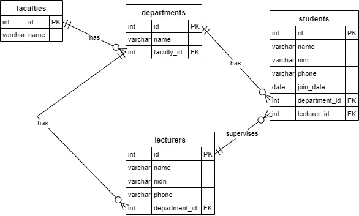

# Tugas Praktikum 8 DPBO 2025 C1  
Raffi Adzril Alfaiz - Ilmu Komputer UPI  
---

## Janji
Saya, **Raffi Adzril Alfaiz** dengan **NIM 2308355**, mengerjakan Tugas Praktikum 8 dalam mata kuliah **Desain dan Pemrograman Berorientasi Objek** untuk keberkahan-Nya. Maka saya **tidak melakukan kecurangan** seperti yang telah dispesifikasikan. Aamiin.  
---

# Website OOP CRUD Management System

## Deskripsi Singkat
Website ini adalah implementasi konsep **Object-Oriented Programming (OOP)** menggunakan bahasa pemrograman **PHP**, dengan dukungan **database MySQL** untuk pengelolaan data. Aplikasi ini menampilkan data seperti fakultas, departemen, dosen, dan mahasiswa, serta menerapkan fitur **CRUD (Create, Read, Update, Delete)**.

---

## Fitur Utama
- CRUD untuk setiap entitas:
  - Faculties
  - Departments
  - Lecturers
  - Students
- Relasi antar entitas sesuai dengan **Entity Relationship Diagram (ERD)**.
- Modularisasi kode: pemisahan antara model, view, dan controller.
- Desain responsif menggunakan **Bootstrap**.
- Keamanan query menggunakan **Prepared Statements** (PDO).

---

## Entity Relationship Diagram (ERD)
Berikut adalah diagram ERD yang digunakan dalam aplikasi ini:



---

## Dokumentasi Video
Berikut adalah video dokumentasi untuk aplikasi ini:

- **[Tonton di GitHub](https://github.com/user-attachments/assets/6bdfd1be-72b9-4224-8f3f-150894068147)**
- **[Tonton di Lokal](demo-test/demo-websiteuniversity.mp4)**

---

## Struktur Folder
Berikut adalah struktur folder dari project ini:

```
project/
├── bootstrap.bundle.min.js
├── bootstrap.min.css
├── bootstrap.min.js
├── connection.php
├── departments.php
├── faculties.php
├── index.php
├── jquery.min.js
├── lecturers.php
├── popper.min.js
├── controllers/
│   ├── departements.controller.php
│   ├── faculties.controller.php
│   ├── lecturers.controller.php
│   ├── students.controller.php
├── models/
│   ├── DB.class.php
│   ├── departements.class.php
│   ├── faculties.class.php
│   ├── lecturers.class.php
│   ├── students.class.php
├── templates/
│   ├── departements.html
│   ├── faculties.html
│   ├── index.html
│   ├── lecturers.html
│   └── edit/
│       ├── edit_departments.html
│       ├── edit_faculties.html
│       ├── edit_lecturers.html
│       ├── edit_students.html
├── views/
│   ├── departements.view.php
│   ├── faculties.view.php
│   ├── lecturers.view.php
│   ├── students.view.php
│   └── edit/
│       ├── edit_departments.view.php
│       ├── edit_faculties.view.php
│       ├── edit_lecturers.view.php
│       ├── edit_students.view.php
```

---

## Penjelasan File
### Root Folder
- **`index.php`**: Entry point utama aplikasi yang berisikan students
- **`connection.php`**: Konfigurasi koneksi database.
- **`departments.php`**, **`faculties.php`**, **`lecturers.php`**, **`students.php`**: File untuk meng-handle request CRUD masing-masing entitas.

### Folder `controllers/`
Berisi file controller untuk setiap entitas:
- **`departements.controller.php`**: Mengatur logika CRUD untuk departemen.
- **`faculties.controller.php`**: Mengatur logika CRUD untuk fakultas.
- **`lecturers.controller.php`**: Mengatur logika CRUD untuk dosen.
- **`students.controller.php`**: Mengatur logika CRUD untuk mahasiswa.

### Folder `models/`
Berisi file model untuk setiap entitas:
- **`DB.class.php`**: Kelas utama untuk koneksi database.
- **`departements.class.php`**, **`faculties.class.php`**, **`lecturers.class.php`**, **`students.class.php`**: Model untuk masing-masing entitas.

### Folder `templates/`
Berisi file HTML template:
- **`departements.html`**, **`faculties.html`**, **`lecturers.html`**, **`index.html`**: Template untuk halaman utama setiap entitas.
- **`edit/`**: Berisi template untuk form edit setiap entitas.

### Folder `views/`
Berisi file view untuk setiap entitas:
- **`departements.view.php`**, **`faculties.view.php`**, **`lecturers.view.php`**, **`students.view.php`**: View untuk menampilkan data setiap entitas.
- **`edit/`**: Berisi view untuk form edit setiap entitas.

---

## Teknologi yang Digunakan
- PHP 8+
- MySQL
- HTML + CSS
- Bootstrap
- XAMPP / Apache sebagai web server lokal

---

## Author
- Nama: **Raffi Adzril Alfaiz**
- NIM: **2308355**
- Kelas: **C1 - Ilmu Komputer**
- Universitas Pendidikan Indonesia